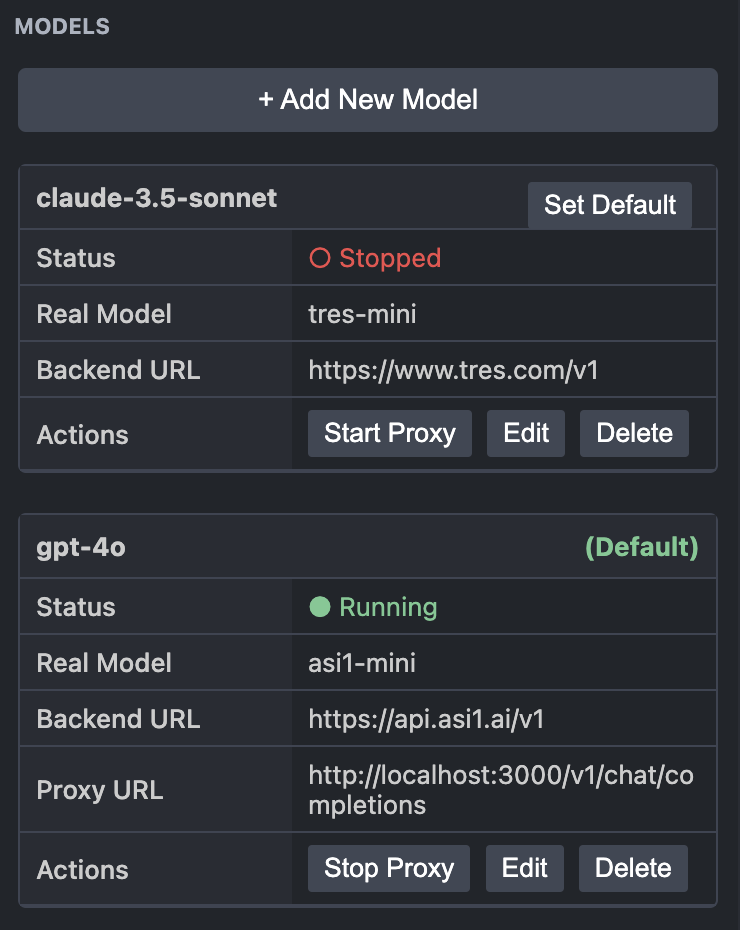

# LLM Proxy

This extension allows any BYOK (Bring Your Own Key) AI editor or extension, such as Cursor or Continue, to connect to any HTTP-compatible LLM by aliasing it as a different model (e.g., `gpt-4o`). The extension starts a local server that proxies requests, enabling you to bypass restrictions and unlock features that are often limited to specific models like Claude or OpenAI's GPT series.

  

## Why Use LLM Proxy?

Many AI-powered IDEs and extensions that support BYOK still restrict access to advanced features—such as Agent mode, image and voice inputs, or multi-modal capabilities—to a small, hardcoded list of models. This means that even if you have access to a powerful open-source model, you might not be able to use it to its full potential.

LLM Proxy solves this problem by acting as a middleman. It intercepts requests from your editor, swaps the model alias with the real model name you want to use, and forwards the request to your self-hosted or cloud-hosted LLM. This tricks the editor into thinking you are using a supported model, unlocking all its features for use with any compatible LLM.

## Features

- **Universal Compatibility:** Works with any HTTP-compatible LLM, including Ollama, OpenRouter, and custom endpoints.
- **Unlock Restricted Features:** Enables Agent mode, multi-modal inputs, and other advanced features in popular AI extensions.
- **Simple Configuration:** Easily add and manage model aliases through commands.
- **Automatic Start-up:** The proxy server starts automatically when you open.
- **Status Bar Indicator:** Quickly check the proxy's status from the status bar.

## Setup

1.  Install the LLM Proxy extension from the Marketplace.
2.  Open the command palette (`Ctrl+Shift+P` or `Cmd+Shift+P`).
3.  Run the **LLM Proxy: Add Model** command.
4.  Follow the prompts to configure your model:
    *   **Alias:** Enter a well-known model name to trick the editor (e.g., `gpt-4o`, `claude-3-opus-20240229`).
    *   **URL:** Provide the base URL of your LLM endpoint (e.g., `http://localhost:11434` for Ollama).
    *   **Real Model:** Enter the actual model name you want to use (e.g., `llama3`, `codegemma`).

## Usage

Once the proxy is running, configure your AI extension to use the local proxy server:

-   **API Base URL:** `http://localhost:4891/v1`
-   **Model:** Select the alias you created (e.g., `gpt-4o`).

That's it! Your editor will now send requests to the local proxy, which will forward them to your chosen LLM while unlocking all its features.

## License

This extension is licensed under the MIT License. See the [LICENSE](LICENSE) file for details.
